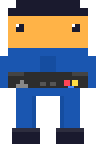

<!-- ═══════════════ SPACE HEADER ═══════════════ -->

 

<!-- ═══════════════ SPACE STRIP (stars + TARDIS) ═══════════════ -->

 

<!-- ═══════════════ HERO: TARDIS + GAMER | SKILLS + CONTACT ═══════════════ -->
<table border="0" cellpadding="20" cellspacing="0">
<tr>
<td align="center" valign="middle">

  

</td>
<td align="left" valign="middle">

<table border="0" cellpadding="5" cellspacing="0">
<tr>
<td align="right"><kbd>&nbsp;languages&nbsp;</kbd></td>
<td>

</td>
</tr>
<tr>
<td align="right"><kbd>&nbsp;frontend&nbsp;&nbsp;</kbd></td>
<td>

</td>
</tr>
<tr>
<td align="right"><kbd>&nbsp;tools&nbsp;&nbsp;&nbsp;&nbsp;&nbsp;</kbd></td>
<td>

</td>
</tr>
</table>

 

&nbsp;

&nbsp;

</td>
</tr>
</table>

<!-- ═══════════════ COSMIC SNAKE ═══════════════ -->
<picture>
  <source media="(prefers-color-scheme: dark)" srcset="https://raw.githubusercontent.com/sayang7/sayang7/output/github-contribution-grid-snake-cosmic.svg"/>
  <source media="(prefers-color-scheme: light)" srcset="https://raw.githubusercontent.com/sayang7/sayang7/output/github-contribution-grid-snake.svg"/>
  
</picture>

<!-- ═══════════════ ACTIVITY GRAPH ═══════════════ -->

 

<!-- ═══════════════ STATS ═══════════════ -->

&nbsp;

  

<!-- ═══════════════ SPACE FOOTER ═══════════════ -->

